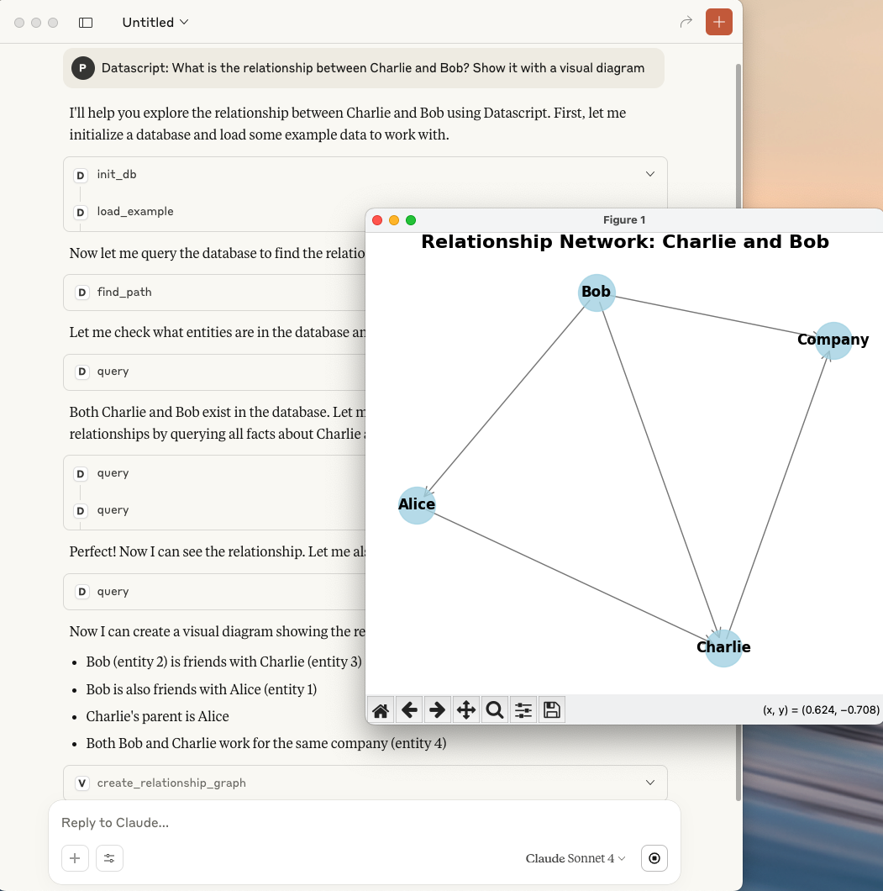
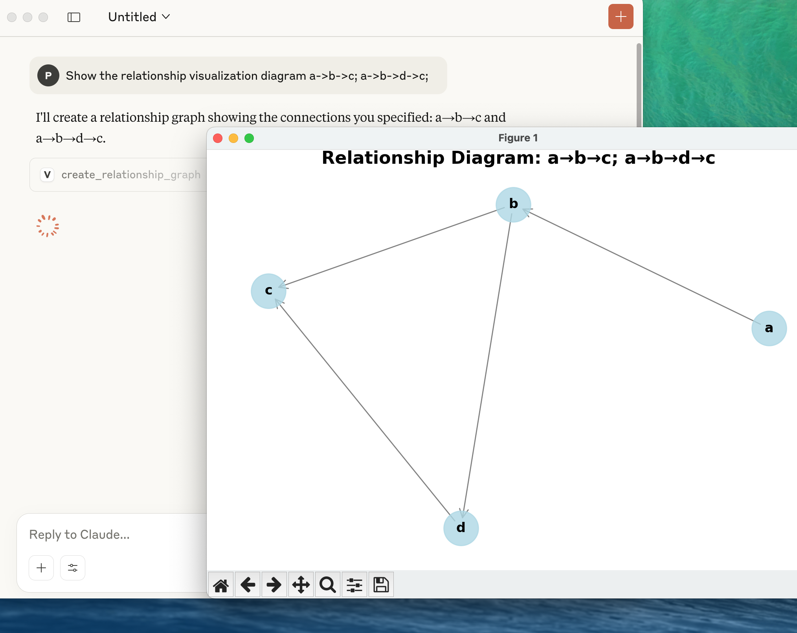
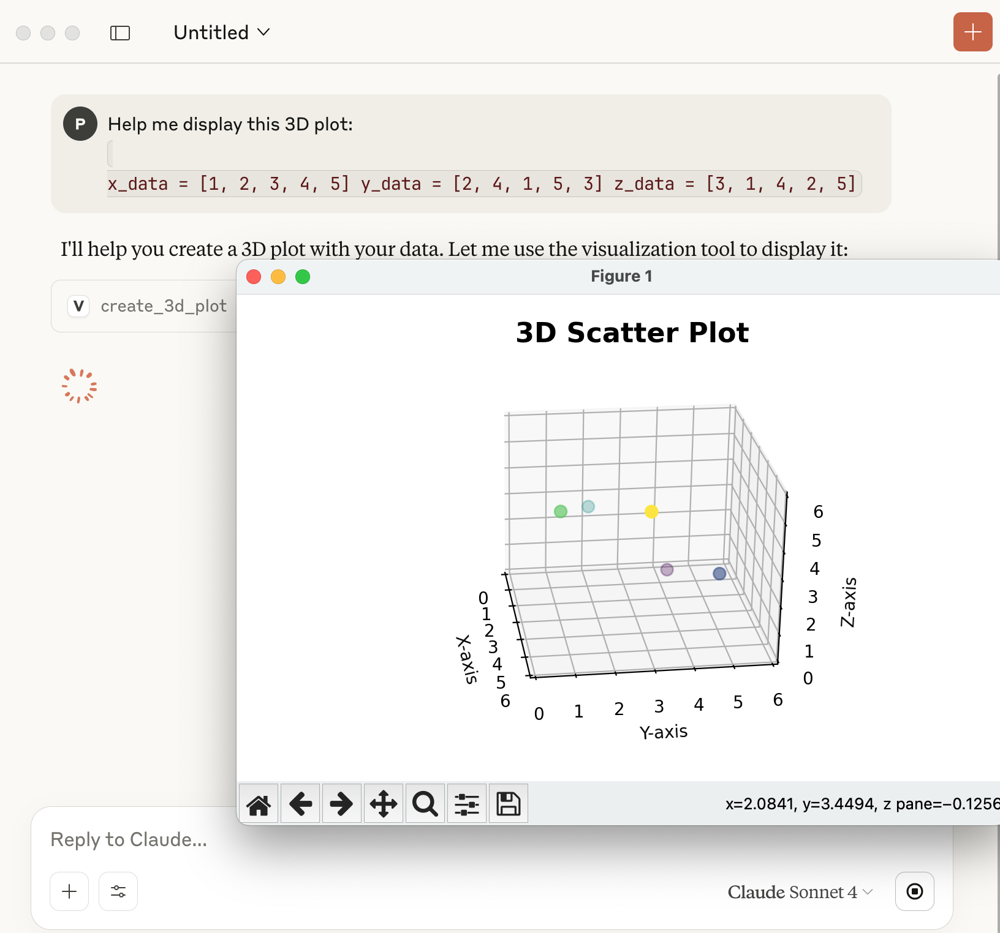

# Visualization MCP Server

A powerful Model Context Protocol (MCP) server for creating interactive data visualizations using matplotlib. This server provides comprehensive visualization tools including relationship graphs, scatter plots, 3D visualizations, and more.



## Features

- 🔗 **Relationship Graphs**: Create network diagrams to visualize connections between entities
- 📊 **Scatter Plots**: Basic and classification scatter plots with customizable styling
- 🌐 **3D Visualizations**: Support for 3D scatter plots, surface plots, and wireframes
- 📈 **Statistical Charts**: Histograms, line plots, and heatmaps
- 💾 **Auto-save**: Automatically saves high-resolution images to temporary directory
- 🖼️ **Live Display**: Shows plots in interactive matplotlib windows
- 🎨 **Customizable**: Extensive styling options for colors, labels, and layouts

## Installation

### Prerequisites

```bash

$ python3 -m venv .venv --upgrade-deps 

$ source .venv/bin/activate

$ pip install "mcp[cli]" httpx

$ pip install   matplotlib numpy pandas networkx

```

### Clone and Run

```bash
git clone https://github.com/yourusername/visualization-mcp-server.git
cd visualization-mcp-server
python visualization_server.py
```

## Usage

## 1. Cladue Desktop Client Config

```json
    "visualization": {
      "command": "/Users/clojure/Desktop/visualization-mcp-server/.venv/bin/python",
      "args": [
        "/Users/clojure/Desktop/visualization-mcp-server/visualization_server.py"
      ]
    }

```

The server provides several visualization tools that can be called via MCP protocol:

### 1. Relationship Graph



Create network diagrams to show relationships between entities:

```python
# Example: Show relationships between A, B, C, D
nodes = ["Alice", "Bob", "Charlie", "Diana"]
edges = [["Alice", "Bob"], ["Bob", "Charlie"], ["Alice", "Charlie"], ["Charlie", "Diana"]]

# Call: create_relationship_graph(nodes, edges, "Social Network")
```

**Parameters:**
- `nodes`: List of node names
- `edges`: List of connections (pairs of node names)
- `title`: Graph title (optional)
- `node_size`: Size of nodes (default: 1000)
- `font_size`: Label font size (default: 12)

### 2. Scatter Plot

Create basic scatter plots with optional labels and colors:

```python
# Example: Basic scatter plot
x_data = [1, 2, 3, 4, 5]
y_data = [2, 5, 3, 8, 7]
labels = ["Point A", "Point B", "Point C", "Point D", "Point E"]

# Call: create_scatter_plot(x_data, y_data, labels, title="My Scatter Plot")
```

**Parameters:**
- `x_data`: X-axis values
- `y_data`: Y-axis values
- `labels`: Point labels (optional)
- `colors`: Point colors (optional)
- `title`, `x_label`, `y_label`: Chart labels
- `size`: Point size (default: 50)

### 3. Classification Scatter Plot

Visualize data points grouped by categories:

```python
# Example: Classification visualization
x_data = [1, 2, 3, 4, 5, 6]
y_data = [2, 3, 1, 5, 4, 6]
categories = ["Type A", "Type A", "Type B", "Type B", "Type C", "Type C"]

# Call: create_classification_plot(x_data, y_data, categories)
```

**Parameters:**
- `x_data`: X-axis values
- `y_data`: Y-axis values
- `categories`: Category labels for each point
- `title`, `x_label`, `y_label`: Chart labels

### 4. 3D Visualization



Create 3D plots with multiple visualization types:

```python
# Example: 3D scatter plot
x_data = [1, 2, 3, 4, 5]
y_data = [2, 4, 1, 5, 3]
z_data = [3, 1, 4, 2, 5]

# Call: create_3d_plot(x_data, y_data, z_data, plot_type="scatter")
```

**Parameters:**
- `x_data`, `y_data`, `z_data`: 3D coordinates
- `plot_type`: "scatter", "surface", or "wireframe"
- `title`, `x_label`, `y_label`, `z_label`: Chart labels

### 5. Additional Charts

#### Histogram
```python
# create_histogram(data, bins=30, title="Distribution")
```

#### Line Plot
```python
# create_line_plot(x_data, y_data, line_style="-", color="blue")
```

#### Heatmap
```python
# create_heatmap(data_matrix, x_labels, y_labels, colormap="viridis")
```

## Output

Each visualization function:
1. **Displays** the plot in an interactive matplotlib window
2. **Saves** a high-resolution PNG file to the system temporary directory
3. **Returns** the file path where the image was saved

Example output:
```
"Graph saved to: /tmp/relationship_graph_20250802_143022.png and displayed"
```

## File Management

- Images are saved with timestamps to avoid conflicts
- Files are stored in the system temporary directory:
  - **Windows**: `C:\Users\username\AppData\Local\Temp\`
  - **macOS/Linux**: `/tmp/`
- High resolution (300 DPI) PNG format

## MCP Integration

This server follows the Model Context Protocol standard and can be integrated with MCP-compatible clients. The server runs on stdio transport by default.

### Server Configuration

```python
if __name__ == "__main__":
    mcp.run(transport='stdio')
```

## Examples

### Social Network Analysis
```python
# Visualize social connections
nodes = ["Alice", "Bob", "Charlie", "Diana", "Eve"]
relationships = [
    ["Alice", "Bob"], 
    ["Bob", "Charlie"], 
    ["Charlie", "Diana"],
    ["Alice", "Eve"], 
    ["Eve", "Diana"]
]
# Creates a network graph showing social connections
```

### Data Classification
```python
# Visualize machine learning results
features_x = [1.2, 2.3, 1.8, 3.1, 2.9, 1.5]
features_y = [2.1, 3.2, 1.9, 4.1, 3.8, 2.2]
predictions = ["Class A", "Class B", "Class A", "Class B", "Class B", "Class A"]
# Creates a classification scatter plot
```

### Scientific Data
```python
# 3D scientific visualization
x_coords = [0, 1, 2, 3, 4]
y_coords = [0, 1, 4, 9, 16]
z_coords = [0, 1, 8, 27, 64]
# Creates a 3D surface or scatter plot
```

## Error Handling

The server includes comprehensive error handling:
- Invalid data format detection
- Missing parameter validation
- Matplotlib rendering error recovery
- File system permission checks

## Contributing

1. Fork the repository
2. Create a feature branch (`git checkout -b feature/amazing-feature`)
3. Commit your changes (`git commit -m 'Add amazing feature'`)
4. Push to the branch (`git push origin feature/amazing-feature`)
5. Open a Pull Request

## License

This project is licensed under the MIT License - see the [LICENSE](LICENSE) file for details.

## Dependencies

- `matplotlib`: Core plotting library
- `networkx`: Graph/network visualization
- `numpy`: Numerical computations
- `pandas`: Data manipulation
- `mcp`: MCP server framework

## Roadmap

- [ ] Interactive plot widgets
- [ ] Animation support
- [ ] Export to multiple formats (SVG, PDF)
- [ ] Custom color schemes
- [ ] Statistical analysis integration
- [ ] Real-time data streaming plots

## Support

If you encounter any issues or have questions:
1. Check the [Issues](https://github.com/xlisp/visualization-mcp-server/issues) page
2. Create a new issue with detailed description
3. Include sample data and error messages

---

**Made with ❤️ for the MCP ecosystem**
